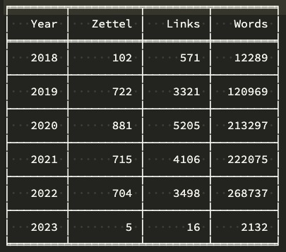

# The Archive "annual_stats"
 This is a quick Python app that generates a Markdown-compatible table of yearly zettelkasting stats for users of The Archive.

## Installation Instructions
### Quick Start

1. Install the dependency `pip install tabulate`  
2. Open `main.py` in an editor and edit the user setting section

## Usage (Example)
Change to the directory where you installed the application and run the following command in Terminal.  
 
    python main.py 
You'll be prompted to enter the 4 digit year of your oldest note. 

    Earliest year:   
Look for the output where you specified with the `table_output` variable.  

### Sample Output 

## Disclaimer

When it comes to Python, I am just a hobbyist. So it's very likely I made some mistakes. Please bear with me. Let me know and I'll fix things and in doing so, you'll be teaching me to be a better programmer.
